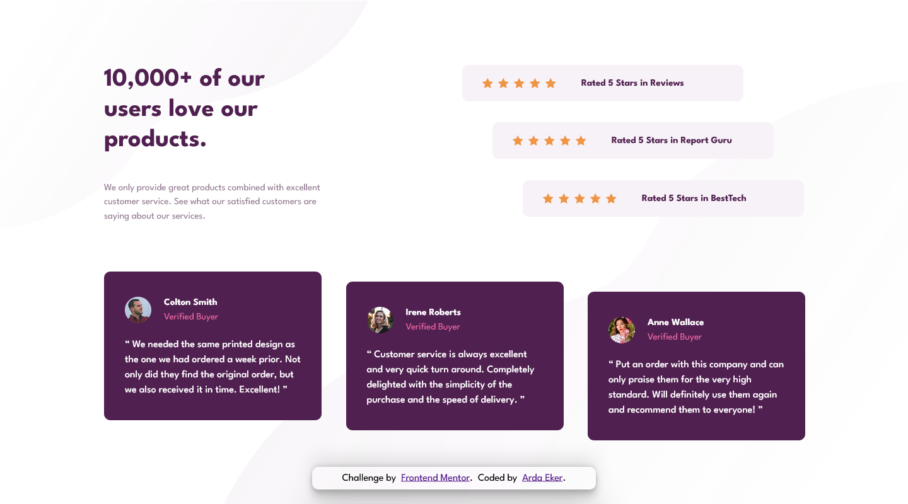
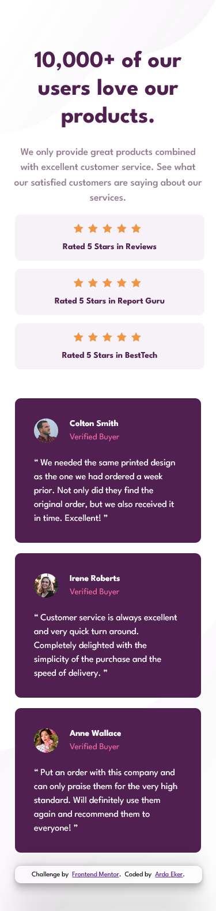

# Frontend Mentor - Social proof section solution

This is a solution to the [Social proof section challenge on Frontend Mentor](https://www.frontendmentor.io/challenges/social-proof-section-6e0qTv_bA). Frontend Mentor challenges help you improve your coding skills by building realistic projects.

## Table of contents

- [Frontend Mentor - Social proof section solution](#frontend-mentor---social-proof-section-solution)
  - [Table of contents](#table-of-contents)
  - [Overview](#overview)
    - [The challenge](#the-challenge)
    - [Screenshot](#screenshot)
    - [Links](#links)
  - [Author](#author)

## Overview

### The challenge

Users should be able to:

- View the optimal layout for the section depending on their device's screen size

### Screenshot

### Links

- Solution URL: [Solution URL here](https://www.frontendmentor.io/solutions/social-proof-section-yhWa5Ecayw)
- Live Site URL: [Live site URL here](https://ardaekerfrontendmentor-10.netlify.app/)

## Author

- Frontend Mentor - [@ardaekerFD](https://www.frontendmentor.io/profile/ardaekerFD)
